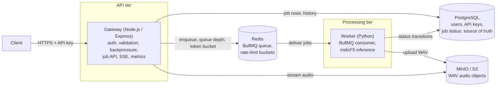
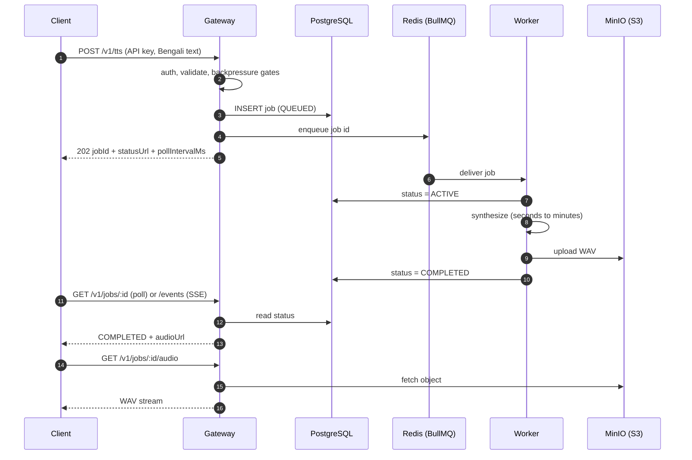
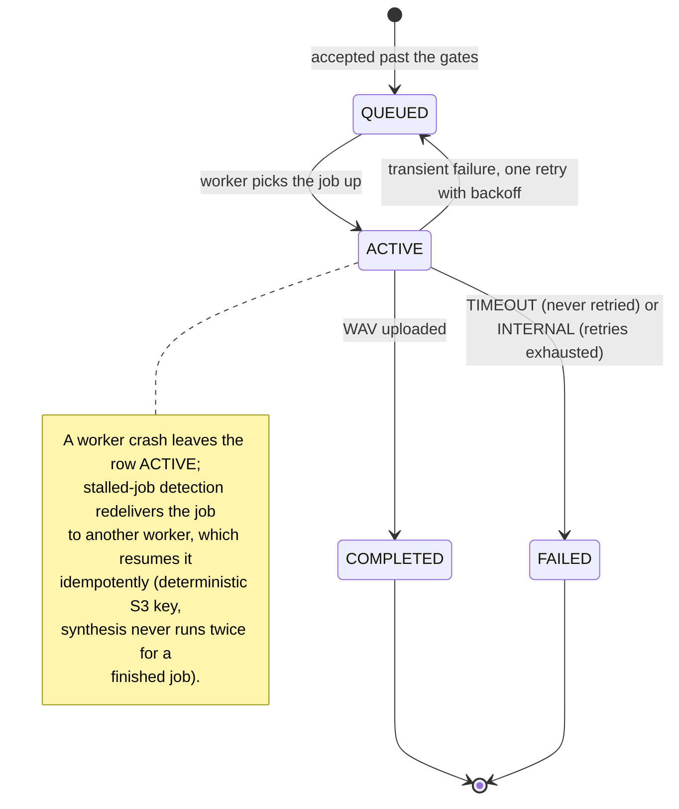
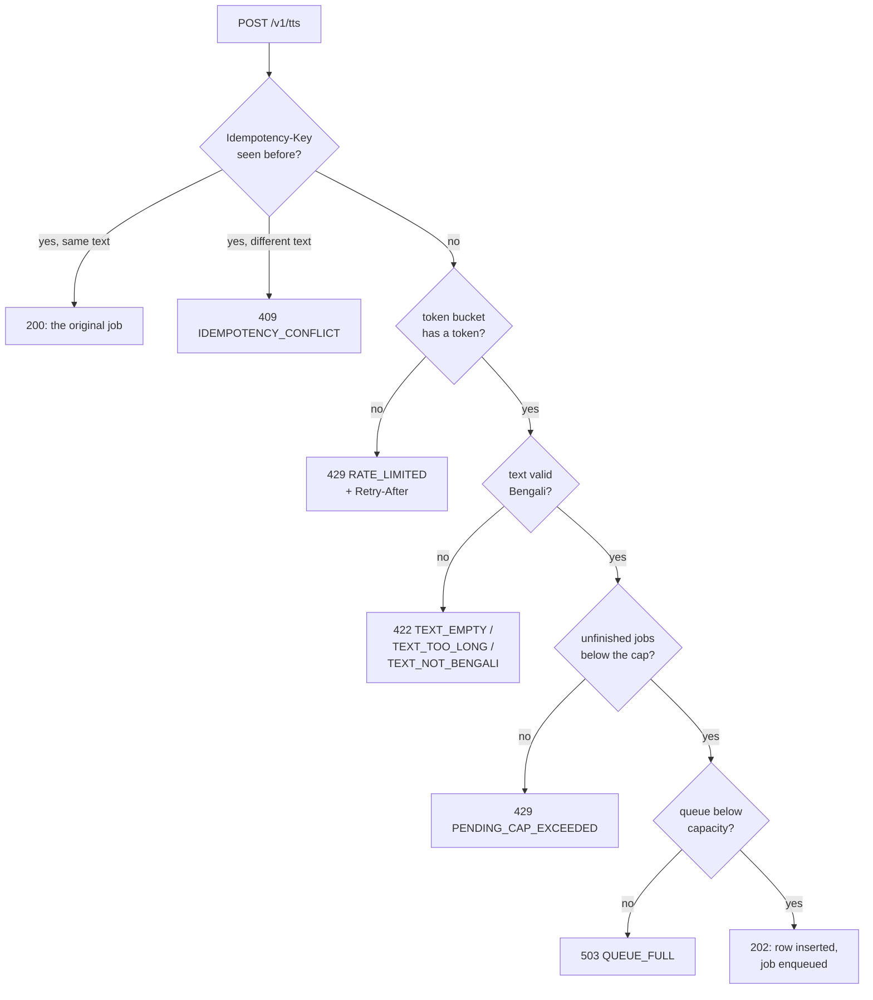
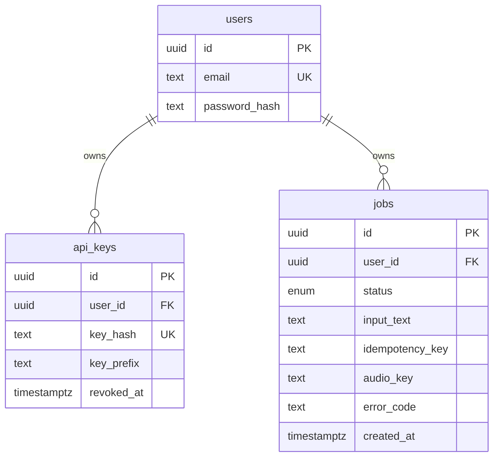
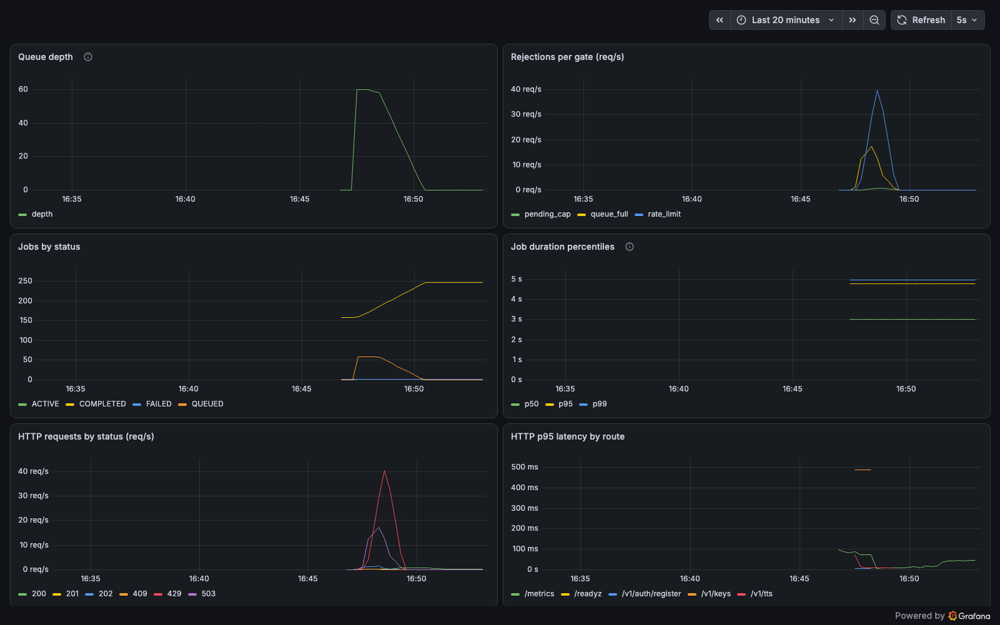

# Bengali TTS Service

A multi-user API service that turns Bengali text into playable audio using the [IndicF5](https://huggingface.co/ai4bharat/IndicF5) text-to-speech model. A user registers, obtains an API key, and submits text as a job. Submission returns immediately with a job id; synthesis runs in the background, so slow inference never blocks the client. The user polls the job (or subscribes to a live status stream) until it completes, then downloads the result as a WAV file.

The design centers on three constraints: inference is slow and compute-bound, users must be strictly isolated from each other, and the service must stay responsive under concurrent load instead of degrading for everyone.

## Quick start

```bash
docker compose up -d --build
./scripts/e2e-smoke.sh
```

That is the whole setup. The smoke script registers a user, issues a key, submits Bengali text, waits for completion, downloads the audio, and verifies it is a playable WAV.

By default the worker runs a **fake engine** that produces valid placeholder WAVs instantly, which exercises the entire pipeline (auth, queueing, backpressure, storage, streaming) without a 2 GB model download. To run real IndicF5 synthesis:

```bash
TTS_ENGINE=indicf5 HF_TOKEN=hf_your_token docker compose up -d --build
```

IndicF5 is a gated model; see [docs/indicf5-setup.md](docs/indicf5-setup.md) for access setup, download size, GPU selection, and expected CPU latency. On an Apple Silicon Mac (or a GPU host without container GPU passthrough) the worker can run natively against the composed infrastructure and use the host GPU; the same doc covers that hybrid setup.

To hear the real model without any of that: [docs/samples/bengali-sample.wav](docs/samples/bengali-sample.wav) is a committed sample produced by this exact stack running IndicF5 on CPU, for the input text "এই সেবাটি বাংলা লেখা থেকে স্পষ্ট ও স্বাভাবিক কথ্য বাংলা তৈরি করে।" ("This service produces clear and natural spoken Bengali from Bengali text.").

To also bring up Prometheus and Grafana (pre-provisioned dashboard, no manual configuration):

```bash
docker compose --profile monitoring up -d --build
# Grafana at http://localhost:3001, anonymous viewer access
```

## Architecture

### Components

Who talks to whom. The gateway and worker never talk directly; jobs flow through Redis, status through PostgreSQL, audio through S3.



The gateway (Node.js/TypeScript) owns everything request-shaped: registration, API keys, validation, backpressure, the job API, and audio delivery. The worker (Python) owns inference: it consumes jobs from the queue one at a time, runs the model, uploads the WAV, and writes status transitions. Rationale for each choice is recorded in [docs/adr/](docs/adr/).

### One job, end to end

What happens in what order, and when the client hears back. The client is released at step 5 with a `202`; everything after runs in the background at the worker's pace.



### Job lifecycle

Every status a job can hold and every way it moves between them. The database row is the single source of truth; terminal statuses are guarded at the SQL level and are never overwritten, so a late or duplicate worker cannot change a finished job's outcome.



Delivery is at-least-once and every processing step is idempotent, so the outcome is exactly-once. Timeouts fail immediately without retry (a pathological input would only time out again); other synthesis errors get one retry before landing in `FAILED` with a stable, machine-readable error code that stays visible in job history.

## API walkthrough

The full flow, runnable against the quick-start stack. Every `/v1` endpoint returns JSON; errors always have the shape `{"error": {"code": "...", "message": "..."}}`.

**1. Register** (email + password):

```bash
curl -X POST http://localhost:3000/v1/auth/register \
  -H 'Content-Type: application/json' \
  -d '{"email": "rahim@example.com", "password": "a sufficiently long password"}'
```

**2. Create an API key** (HTTP Basic with your registration credentials). The full key appears only in this response; only its hash is stored:

```bash
curl -X POST http://localhost:3000/v1/keys -u 'rahim@example.com:a sufficiently long password'
# => {"id": "...", "key": "sk_live_...", ...}
export API_KEY=sk_live_your_key_here
```

Keys can be listed (`GET /v1/keys`, shows prefixes only) and revoked (`DELETE /v1/keys/:id`, takes effect immediately). `GET /v1/me` confirms which user a key belongs to.

There is deliberately no login/session endpoint: password credentials exist only to manage API keys (checked per request via Basic auth), and every API call authenticates with a key. Browser session auth (JWT/cookies) is out of scope for a machine-facing API; this is the same shape as the major API platforms, where a dashboard session mints keys and the keys do all the work.

**3. Submit a job** (Bearer auth with the API key):

```bash
curl -X POST http://localhost:3000/v1/tts \
  -H "Authorization: Bearer $API_KEY" \
  -H 'Content-Type: application/json' \
  -d '{"text": "আগামীকাল সকাল দশটায় প্রকল্পের অগ্রগতি নিয়ে একটি সভা অনুষ্ঠিত হবে।"}'
# => 202 {"jobId": "...", "status": "QUEUED", "statusUrl": "/v1/jobs/...", "pollIntervalMs": 2000}
```

Input must be predominantly Bengali (digits, punctuation, and occasional loanwords are fine) and within the length cap; violations return `422` with `TEXT_EMPTY`, `TEXT_TOO_LONG`, or `TEXT_NOT_BENGALI`.

To make submission safe to retry after a network failure, pass an `Idempotency-Key` header. Re-submitting the same key with the same payload returns the original job (`200`) instead of creating a duplicate; the same key with a different payload is rejected (`409 IDEMPOTENCY_CONFLICT`). Keys are scoped per user and enforced by a database constraint, so even racing duplicate submissions produce exactly one job.

```bash
curl -X POST http://localhost:3000/v1/tts \
  -H "Authorization: Bearer $API_KEY" \
  -H 'Idempotency-Key: order-42' \
  -H 'Content-Type: application/json' \
  -d '{"text": "আজকের আবহাওয়া খুব সুন্দর এবং আকাশ পরিষ্কার।"}'
```

**4. Follow the job**, either by polling:

```bash
curl -H "Authorization: Bearer $API_KEY" http://localhost:3000/v1/jobs/$JOB_ID
```

or by subscribing to the live status stream (Server-Sent Events; sends the current status immediately, then each transition, and closes after a terminal status):

```bash
curl -N -H "Authorization: Bearer $API_KEY" http://localhost:3000/v1/jobs/$JOB_ID/events
# event: status
# data: {"id":"...","status":"ACTIVE",...}
#
# event: status
# data: {"id":"...","status":"COMPLETED","audioUrl":"/v1/jobs/.../audio",...}
```

**5. Download the audio**:

```bash
curl -H "Authorization: Bearer $API_KEY" \
  http://localhost:3000/v1/jobs/$JOB_ID/audio -o speech.wav
```

**6. Browse history** (cursor-paginated, newest first; failed jobs stay visible with their error):

```bash
curl -H "Authorization: Bearer $API_KEY" 'http://localhost:3000/v1/jobs?limit=20'
# => {"jobs": [...], "nextCursor": "..." | null}
curl -H "Authorization: Bearer $API_KEY" "http://localhost:3000/v1/jobs?limit=20&cursor=$NEXT_CURSOR"
```

Every job-scoped route is strictly owner-only. Another user's job id behaves exactly like a nonexistent one (`404 NOT_FOUND`, byte-identical response), so job ids leak no information across accounts.

### Backpressure

Three gates protect the service, checked in order on every submission. Every rejection fires before any job row or queue entry exists, so saying no costs almost nothing:



Each rejection is machine-readable so clients know what to do next:

| Gate | Scope | Response | Client action |
| --- | --- | --- | --- |
| Request rate (token bucket) | per user | `429 RATE_LIMITED` + `Retry-After` | Slow down, retry after the header value |
| Unfinished-job cap (`QUEUED` + `ACTIVE`) | per user | `429 PENDING_CAP_EXCEEDED` | Wait for running jobs instead of retrying |
| Queue depth | global | `503 QUEUE_FULL` | Back off; the whole service is at capacity |

An idempotent retry (same `Idempotency-Key`) is answered from the stored job *before* the gates, so a client that never received its response can always recover it, even when the queue is full.

### Error codes

| Code | Status | Meaning |
| --- | --- | --- |
| `VALIDATION_ERROR`, `INVALID_PARAMETER`, `MALFORMED_JSON` | 422 / 400 | Malformed body, query, or header |
| `TEXT_EMPTY`, `TEXT_TOO_LONG`, `TEXT_NOT_BENGALI` | 422 | Input text rejected before any job is created |
| `MISSING_CREDENTIALS`, `INVALID_CREDENTIALS` | 401 | Basic auth (key management routes) |
| `MISSING_API_KEY`, `INVALID_API_KEY`, `REVOKED_API_KEY`, `UNAUTHENTICATED` | 401 | Bearer auth (job routes) |
| `EMAIL_TAKEN` | 409 | Registration with an existing email |
| `IDEMPOTENCY_CONFLICT` | 409 | Same `Idempotency-Key`, different payload |
| `RATE_LIMITED`, `PENDING_CAP_EXCEEDED`, `QUEUE_FULL` | 429 / 503 | Backpressure gates above |
| `JOB_NOT_READY`, `JOB_FAILED` | 409 | Audio requested before completion / after failure |
| `NOT_FOUND` | 404 | Unknown resource, or a resource owned by someone else |
| `TIMEOUT`, `INTERNAL` | in job body | Terminal failure codes on the job itself, not HTTP errors |

## Configuration

All settings are environment variables with working defaults; `docker compose up` needs none of them. Compose passes the tunable ones through, so `TTS_PENDING_CAP=3 docker compose up -d` just works.

### Gateway

| Variable | Default | Purpose |
| --- | --- | --- |
| `PORT` | `3000` | HTTP listen port (host port via `GATEWAY_PORT`) |
| `DATABASE_URL`, `REDIS_URL`, `S3_ENDPOINT`, `S3_ACCESS_KEY`, `S3_SECRET_KEY`, `S3_BUCKET` | compose-internal | Infrastructure endpoints |
| `LOG_LEVEL` | `info` | pino log level |
| `TTS_MAX_TEXT_LENGTH` | `1000` | Input text length cap (codepoints) |
| `TTS_RATE_LIMIT_PER_MINUTE` | `30` | Per-user token bucket refill rate |
| `TTS_PENDING_CAP` | `10` | Per-user cap on unfinished jobs |
| `TTS_QUEUE_CAPACITY` | `100` | Global queue depth limit |
| `TTS_JOB_ATTEMPTS` | `2` | Total delivery attempts per job (2 = one retry) |
| `TTS_RETRY_BACKOFF_MS` | `5000` | Base for exponential retry backoff |
| `POLL_INTERVAL_MS` | `2000` | Polling interval suggested to clients |
| `SSE_POLL_INTERVAL_MS` | `1000` | How often each SSE stream re-reads its job row |

### Worker

| Variable | Default | Purpose |
| --- | --- | --- |
| `TTS_ENGINE` | `fake` | `fake` (instant placeholder WAVs) or `indicf5` (real inference) |
| `TTS_DEVICE` | `auto` | `auto`, `cuda`, `mps`, or `cpu` |
| `HF_TOKEN` | none | Hugging Face token for the gated IndicF5 weights |
| `TTS_JOB_TIMEOUT_SECONDS` | `300` | Jobs running longer are marked `FAILED` with code `TIMEOUT` |
| `TTS_FAKE_DELAY_SECONDS` | `0` | Fake engine only: simulated latency for load testing |

## Design trade-offs

**Two languages, two services.** IndicF5 is Python/PyTorch; the API tier's concerns (many concurrent connections, streaming, low-latency auth checks) suit Node. The process boundary means inference can never block the API event loop, workers scale horizontally on GPU hosts independently of the API tier, and a worker crash mid-inference cannot take the API down. Details and alternatives in [ADR 0001](docs/adr/0001-node-gateway-python-worker-split.md).

**Queueing: Redis + BullMQ** ([ADR 0003](docs/adr/0003-redis-bullmq-job-queue.md)). Jobs need buffering, retry with backoff, and crash recovery. BullMQ provides per-job locks with heartbeat renewal, stalled-job detection (a killed worker's job is re-delivered automatically), configurable retries, and has mature clients in both TypeScript and Python. A Postgres-based queue (`SELECT ... FOR UPDATE SKIP LOCKED`) would remove Redis from the stack and was the main alternative; Redis won because the rate limiter wants it anyway and queue depth checks are O(1) there. The queue is treated as plumbing, not truth: if Redis loses data, job rows in Postgres still say what happened.

**Job status lives in PostgreSQL** ([ADR 0002](docs/adr/0002-postgresql-for-job-state-and-users.md)), and only there. The worker's every transition is a row update; the gateway reads rows for status, history, and the SSE stream. Keeping one source of truth makes the crash-recovery story simple to reason about: at-least-once delivery plus idempotent processing steps yields exactly-once outcomes.

**Audio in object storage, not the database** ([ADR 0004](docs/adr/0004-minio-object-storage-for-audio.md)). WAVs are hundreds of KB to several MB. Rows stay small, backups stay fast, and the API streams audio through without buffering it. MinIO speaks the S3 API, so the production swap is a config change.

**Backpressure: exact where it is a promise, approximate where it is load shedding.** The per-user pending cap is enforced exactly: a per-user advisory lock in Postgres serializes each user's submissions, so a burst of concurrent requests cannot overshoot the cap (users do not contend with each other). The global queue-depth gate is deliberately check-then-act: making it exact would serialize every submission in the system through one lock, and its job is shedding load near capacity, where an overshoot of a few jobs (bounded by the connection pool) is harmless. The same reasoning leads nginx and Envoy to approximate their global limits.

**SSE watches the database, not a message bus.** Each stream sends the current status immediately, then polls the job row and emits changes. The jobs table is the worker's only write channel, so watching it inherits its correctness, and a transition can never slip between the snapshot and the first poll. At higher connection counts the per-connection poll would be replaced by a Redis subscription feeding the same snapshot-then-watch loop; the endpoint contract would not change.

**Scaling paths** (documented, deliberately not built for a compose-based runtime): add worker replicas for throughput (`docker compose up --scale worker=4`; each worker runs one job at a time since inference saturates the compute device); move Postgres/Redis/S3 to managed services (every client already speaks the standard protocol); add gateway replicas behind a load balancer (the gateway is stateless; rate-limit buckets already live in Redis); GPU hosts for inference latency (`TTS_DEVICE=cuda`).

## Capacity

The two tiers saturate at very different points, so "how many users can it handle" has two answers.

**The API tier is not the bottleneck.** In the committed [load test](docs/load-test.md), 20 virtual users offered ~18 requests/second for a minute (a 37x overload against the deliberately tight gate limits of that run) and the gateway answered with a p95 latency of 11 ms while rejecting over 97% of the traffic by policy. Rejections are cheap because every gate fires before a job row or queue entry exists. The gateway is stateless and I/O-bound; hundreds of concurrent polling or SSE clients are comfortable on one instance, and more instances can sit behind a load balancer without coordination.

**Synthesis is the bottleneck, by design.** Throughput is `workers / inference_time`: with one worker and CPU inference at tens of seconds per sentence, that is roughly one to two jobs per minute; a GPU brings inference to seconds, and worker replicas multiply throughput linearly. The gates convert that fixed capacity into explicit promises instead of unbounded queues: each user holds at most `TTS_PENDING_CAP` unfinished jobs (default 10) and `TTS_RATE_LIMIT_PER_MINUTE` submissions per minute (default 30), and the global backlog never exceeds `TTS_QUEUE_CAPACITY` (default 100), which caps the worst-case wait for an accepted job at roughly `TTS_QUEUE_CAPACITY x inference_time / workers`. Sizing a deployment is therefore a knob-turning exercise: pick the wait you can tolerate, set the queue capacity to match your worker fleet, and let the gates reject the rest early and honestly.

**What growing load looks like.** A handful of users never notice the gates. As traffic grows past synthesis capacity, the queue-depth gate starts shedding the excess (`503 QUEUE_FULL`) while accepted jobs keep completing at the same pace, so the service degrades by policy, never by collapse; the load test demonstrates exactly this at 37x overload. The remedy at that point is capacity, not code: `docker compose up --scale worker=4` multiplies synthesis throughput four-fold, and raising `TTS_QUEUE_CAPACITY` to match keeps the worst-case wait constant. When a single gateway instance eventually saturates on connection count, add replicas behind a load balancer: it is stateless, and both the rate-limit buckets (Redis) and the pending-cap serialization (Postgres advisory locks) already live in shared infrastructure, so no coordination is added. Nothing in the architecture changes at any of these steps.

## Database notes

Three tables, managed by committed Prisma migrations that run automatically on gateway start. For working with them directly: `npm run migrate:status` and `npm run migrate:deploy` against a `DATABASE_URL`, and `npm run migrate:diff` prints the SQL for schema changes not yet captured in a migration (it diffs against a shadow database; see `prisma.config.ts`). The diagram abridges columns to the ones that carry design decisions:



- **users**: email (unique) + bcrypt password hash. Registration credentials are used only to manage API keys.
- **api_keys**: SHA-256 hash of the key (unique), display prefix, revocation timestamp. The plaintext key exists only in the creation response. Auth is a single indexed lookup on the hash. Revocation is a timestamp, not a delete, so key history stays auditable.
- **jobs**: owner, status, input text, S3 audio key, error code/message, idempotency key, and lifecycle timestamps. Status transitions are guarded so terminal states are never overwritten by a late or duplicate worker.

Index choices:

- `jobs (user_id, created_at DESC)` serves the history page exactly in its query order: seek to one user, read rows newest-first, stop after one page.
- `jobs (user_id, idempotency_key) UNIQUE` makes idempotency a database guarantee. Postgres treats NULLs as distinct in unique indexes, so the common keyless submissions never collide.
- `api_keys (key_hash) UNIQUE` is the hot path: every authenticated request resolves its key through this index.

The history query plan against a table with 50,000 jobs for one user (captured from the compose Postgres):

```
Limit  (cost=0.51..3.33 rows=21 width=235) (actual time=0.161..0.164 rows=21 loops=1)
  ->  Incremental Sort  (actual time=0.161..0.162 rows=21 loops=1)
        Sort Key: created_at DESC, id DESC
        Presorted Key: created_at
        ->  Index Scan using jobs_user_id_created_at_idx on jobs
              (actual time=0.065..0.067 rows=22 loops=1)
              Index Cond: (user_id = '...')
Execution Time: 0.257 ms
```

The index scan touches 22 rows (one page plus the has-more probe) regardless of how many jobs the user has; the incremental sort only breaks `created_at` ties by id. Pagination is cursor-based rather than offset-based, so pages stay consistent while new jobs arrive and deep pages cost the same as the first.

## Observability

- **Structured JSON logs** with a correlation id that follows a request from submission through queueing, inference, and completion; one grep traces a job end to end across both services.
- **Prometheus metrics** at `/metrics`: queue depth, jobs by status, synthesis duration histogram, backpressure rejections by gate, HTTP latency by route.
- **Grafana dashboard** provisioned automatically under the `monitoring` compose profile.

Captured live during the committed load test: queue depth climbing to capacity and draining, each backpressure gate rejecting in turn, and the request-rate and latency panels staying flat while it happens.



Details, metric reference, and the log-tracing recipe: [docs/observability.md](docs/observability.md).

## Testing

```bash
# Gateway: integration-first, real Postgres/Redis/MinIO via testcontainers
cd gateway && npm install && npm test

# Worker: queue consumer, failure paths, crash recovery
cd worker && python3 -m venv .venv && .venv/bin/pip install -e '.[dev]' && .venv/bin/pytest

# Black-box flow against the compose stack
./scripts/e2e-smoke.sh
```

Both suites need Docker running (they start disposable containers). The gateway suite covers every route, every backpressure gate, cross-user isolation, idempotency races, SSE, and graceful shutdown; the worker suite covers retries, timeouts, killed-worker recovery, and the stalled-job edge cases. A k6 load test with committed results and interpretation lives in [docs/load-test.md](docs/load-test.md).

## Known limitations

- **One voice, one format.** A single bundled reference voice; WAV output only. Voice selection and other formats are out of scope.
- **Global capacity gate is approximate** near the boundary (see trade-offs above); the per-user promises are exact.
- **SSE scales by polling** one query per open stream per second. Fine for hundreds of concurrent streams, needs the documented Redis-subscription swap beyond that. A job that finishes faster than the poll interval may collapse intermediate statuses (the stream jumps from `QUEUED` to `COMPLETED`); the terminal event is never missed.
- **`/metrics` is unauthenticated** by design for an internal scraper on the compose network; lock it down at the ingress before exposing the service beyond a demo.
- **No email verification or password reset.** Registration is deliberately minimal; credential recovery would come before any real deployment.
- **Compose is the runtime.** No Kubernetes manifests or autoscaling; the scaling paths are documented instead.
- **CPU inference is slow** (tens of seconds per sentence). That is inherent to the model; use `TTS_DEVICE=cuda` on a GPU host for production-like latency.
