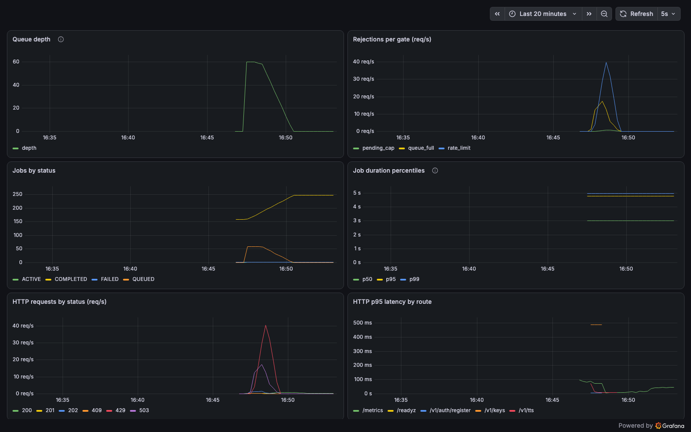

# Observability

## Correlation ids

Every gateway request gets a request id (an incoming `x-request-id` header
is honored, otherwise a UUID is generated) which is:

- echoed back to the client as the `x-request-id` response header,
- attached to every gateway log line for that request (`req.id`),
- carried in the queue payload of a submitted job and bound into every
  worker log line for that synthesis (`correlation_id`).

So one grep traces a job end to end:

```bash
docker compose logs gateway worker | grep <request-id>
```

Logs are JSON in both services (pino in the gateway, structlog in the
worker). The `Authorization` header is redacted before logging; request and
response bodies are never logged, so passwords and raw API keys cannot
reach the log stream. A test asserts this.

## Traces

Metrics say a submission took 45 ms; a trace says where the 45 ms went.
`POST /v1/tts` records a span per stage under one parent, so a slow
submission is attributed rather than guessed at:

```
tts.submit                        44.78 ms  ROOT
  tts.submit.idempotency_replay   17.98 ms   +1.74ms
  tts.submit.rate_limit            1.61 ms   +20.30ms
  tts.submit.validate_text         0.21 ms   +22.55ms
  tts.submit.capacity_and_insert  18.17 ms   +22.82ms
  tts.submit.enqueue               3.65 ms   +41.07ms
```

Read that shape before optimising anything: the two database round trips
account for ~80% of the request, while the three backpressure gates people
assume are expensive cost under 2 ms combined. The replay lookup only
appears when the request carries an `Idempotency-Key`.

The root span carries `request.id`, the same id described above, so a log
line leads to its trace and a trace leads back to its logs:

```bash
# in the Jaeger UI, or:
curl -s 'http://localhost:16686/api/traces?service=bengali-tts-gateway&tags=%7B%22request.id%22%3A%22<request-id>%22%7D'
```

Jaeger runs in the same optional profile as the dashboard, on
<http://localhost:16686>:

```bash
OTEL_EXPORTER_OTLP_ENDPOINT=http://jaeger:4318 docker compose --profile monitoring up -d
```

`OTEL_EXPORTER_OTLP_ENDPOINT` is what turns exporting on. Leave it unset
and spans are still recorded but go nowhere, which is a supported way to
run the service — serving a request never depends on a collector being
up. Spans are batched, so an unreachable collector is dropped span data,
never a slow request. Traces live in Jaeger's memory and are lost on
restart, which is fine for a demo and not a retention strategy.

## Metrics

`GET /metrics` on the gateway serves Prometheus text format.

| Metric | Type | Meaning |
| ------ | ---- | ------- |
| `tts_queue_depth` | gauge | Jobs waiting, delayed, or running, from BullMQ at scrape time |
| `tts_jobs_by_status{status}` | gauge | Job records per status, from the database at scrape time |
| `tts_job_duration_seconds{status}` | histogram | Synthesis start to terminal state, observed at scrape time for newly finished jobs |
| `tts_gate_rejections_total{gate}` | counter | Submissions rejected per backpressure gate (`rate_limit`, `pending_cap`, `queue_full`) |
| `http_request_duration_seconds{method,route,status}` | histogram | HTTP latency, labeled by route pattern (bounded cardinality) |

## Dashboard

Prometheus and Grafana ship behind an optional compose profile:

```bash
docker compose --profile monitoring up -d
```

Prometheus scrapes the gateway every 5 seconds (it is not published on a
host port; only Grafana is). Grafana auto-provisions the datasource and
the "Bengali TTS Service" dashboard from committed config in
`monitoring/`, reachable at <http://localhost:3001/d/tts> with anonymous
view access (admin/admin to edit). Panels: queue depth, rejections per
gate, jobs by status, job duration percentiles, HTTP request rates by
status, and p95 latency by route.

Captured during the documented load-test run (see
[load-test.md](./load-test.md)):



### Exposure choice

The endpoint is deliberately **unauthenticated**: Prometheus scrapers do
not carry per-user API keys, and the data is operational aggregate only,
with no per-user or per-job detail. It is meant to be reachable by an
internal scraper, not the public internet. In this compose demo it shares
the single published gateway port for convenience; in a real deployment
keep it internal (bind a separate management port, or restrict the route
at the ingress/network layer).
